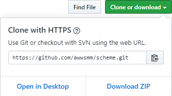
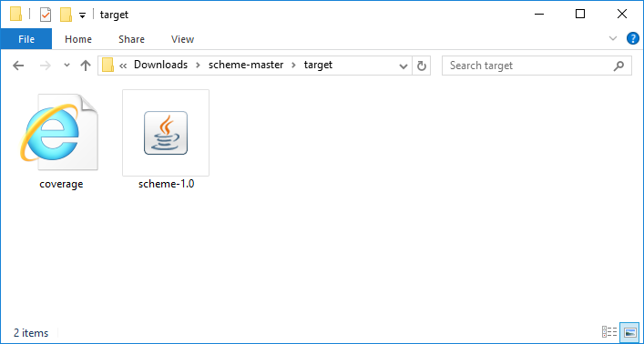

# scheme

A minimal package for intelligently inferring schemata of CSV files.

 [](https://travis-ci.com/awwsmm/scheme) [](https://awwsmm.github.io/scheme/)

- __Self-contained__ -- no external dependencies
- __Compatible__ -- runs on any Java version >= 8
- __Easy__ -- works immediately with no configuration required

Built to more intelligently infer schemata for creating Parquet files from CSV.

---

## Download

Download the repository (and unzip if you downloaded the ZIP file):



Navigate to the `target` directory:

### in Windows Explorer



### in Windows `cmd` prompt

```cmd
C:\>cd C:\Users\myusername\Downloads\scheme-master\target

C:\Users\myusername\Downloads\scheme-master\target>dir
 Volume in drive C is Windows
 Volume Serial Number is 14EE-41C8

 Directory of C:\Users\myusername\Downloads\scheme-master\target

18 Sep 2019  17:30    <DIR>          .
18 Sep 2019  17:30    <DIR>          ..
18 Sep 2019  17:30               931 coverage.svg
18 Sep 2019  17:30            17,449 scheme-1.0.jar
               2 File(s)         18,380 bytes
               2 Dir(s)  2,749,439,602,688 bytes free
```

### in a `bash` (or similar) shell on a UNIX-like OS

```bash
$ git clone https://github.com/awwsmm/scheme.git
Cloning into 'scheme'...
remote: Enumerating objects: 311, done.
remote: Counting objects: 100% (311/311), done.
remote: Compressing objects: 100% (157/157), done.
remote: Total 311 (delta 149), reused 265 (delta 110), pack-reused 0
Receiving objects: 100% (311/311), 541.42 KiB | 1.49 MiB/s, done.
Resolving deltas: 100% (149/149), done.

$ cd scheme/
docs/   .git/   src/    target/

$ cd target/ && ls
coverage.svg  scheme-1.0.jar
```

---

## Usage

### Java >= 9

Easily load the `*.jar` file into the `jshell` and use _scheme_ from there:

```java
$ jshell -cp scheme-1.0.jar

|  Welcome to JShell -- Version 11.0.2
|  For an introduction type: /help intro

jshell> scheme.CSV.schema("../src/main/resources/example0.csv")
$1 ==> [one=class java.lang.Byte, two=class java.lang.Boolean, three=class java.lang.String, four=class java.lang.Integer]
```

### Any Java Version

If you don't have the `jshell`, which is included in all versions of Java 9+, you can still run the _scheme_ `*.jar` file on the command line:

```bash
$ java -jar target/scheme-1.0.jar src/main/resources/example0.csv

file: 'src/main/resources/example0.csv' schema:

one=class java.lang.Byte
two=class java.lang.Boolean
three=class java.lang.String
four=class java.lang.Integer
```

...or, import the file into your own code, compile, and run it:

```bash
$ cat << EOF > MyCode.java
> import scheme.CSV;
>
> public class MyCode {
>   public static void main (String[] args) {
>     CSV.main(args);
>   }
> }
> EOF

$ javac -cp scheme-1.0.jar MyCode.java

$ java -cp scheme-1.0.jar:. MyCode ../src/main/resources/example0.csv

file: '../src/main/resources/example0.csv' schema:

one=class java.lang.Byte
two=class java.lang.Boolean
three=class java.lang.String
four=class java.lang.Integer
```

---

## Convert CSV -> Parquet

To quickly and easily convert a directory full of CSV files to Parquet, follow the procedure outlined in `CSVtoParquet.scala`. Run with:

```scala
$ spark-shell

scala> :load bulkCSVtoParquet.scala
Loading bulkCSVtoParquet.scala...
...

scala> bulkCSVtoParquet("/home/andrew/dirFullOfCSVFiles", "/LL")
```

This function locates all the CSV files in that local directory, infers their schemas, connects to your local Hadoop installation, and writes the files as Parquet files in the specified HDFS directory:

```bash
$ hadoop fs -ls /LL
Found 20 items
drwxr-xr-x   - andrew supergroup          0 2019-09-17 14:58 /LL/F100_20160224_Experiment
drwxr-xr-x   - andrew supergroup          0 2019-09-17 14:58 /LL/F102_20160308_Experiment
drwxr-xr-x   - andrew supergroup          0 2019-09-17 14:58 /LL/F103_20160310
...
```
